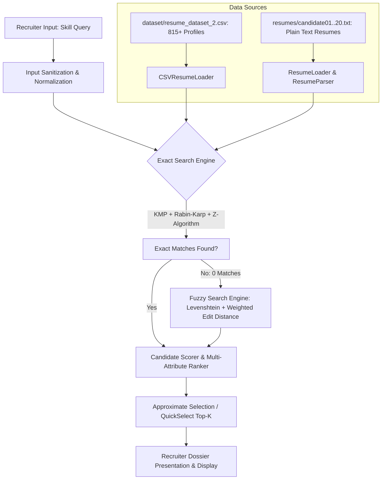

# ResumeX: Automated Resume Search & Candidate Screening System

[](https://www.oracle.com/java/)
[](https://klh.edu.in)
[-red.svg)](https://klh.edu.in)
[](#team-details)
[](#advanced-algorithmic-implementations)

> **KLH CSE | Academic Year 2026–27 | Semester 6 | DSA-3 Project**  
> **Team 6 – ResumeX**

---

## Table of Contents
1. [Project Overview](#project-overview)
2. [Key Features](#key-features)
3. [System Architecture & Workflow](#system-architecture--workflow)
4. [Advanced Algorithmic Implementations](#advanced-algorithmic-implementations)
5. [Algorithm Complexity Matrix](#algorithm-complexity-matrix)
6. [Repository Structure](#repository-structure)
7. [Dataset Information](#dataset-information)
8. [Installation & Setup](#installation--setup)
9. [Running the Application](#running-the-application)
10. [Sample Output & Demonstrations](#sample-output--demonstrations)
11. [Team Details](#team-details)

---

## Project Overview

In contemporary recruitment processes, talent acquisition teams receive hundreds to thousands of unstructured resumes for open positions. Manual candidate screening is inefficient, error-prone, and slow. 

**ResumeX** is an automated, algorithmic resume screening and ranking engine built in Java. It integrates **11 advanced Data Structures and Algorithms (DSA-3)**—spanning exact string matching, approximate/fuzzy string matching, suffix-based index structures, global sequence alignment, combinatorial bipartite matching, and order-statistic selection. 

ResumeX enables recruiters to query specific skill sets and instantly discover, score, and rank candidates from both large structured databases (815+ candidate profiles) and unstructured plain-text resume corpora. If a recruiter inputs misspelled skill names (e.g., `pythn` or `jvaa`), the engine automatically cascades to dynamic-programming-based fuzzy search.

---

## Key Features

- **Multi-Algorithm Exact Matching**: Employs Knuth-Morris-Pratt (KMP), Rabin-Karp rolling hash, and the Z-Algorithm for high-throughput exact pattern searching across candidate skill sets and resume bodies.
- **Multi-Pattern Dictionary Matching**: Aho-Corasick automaton for simultaneous matching of multiple skill keywords in a single linear pass.
- **Fault-Tolerant Fuzzy Search**: Levenshtein Distance and Weighted Edit Distance to tolerate typos, spelling variants, and OCR transcription discrepancies.
- **Biomedical/Bioinformatic Sequence Alignment**: Needleman-Wunsch global alignment scoring algorithm to calculate contextual match affinity.
- **Full-Text Suffix Indexing**: Suffix Array construction coupled with Kasai’s Longest Common Prefix (LCP) algorithm for repeated phrase discovery and fast substring lookups.
- **Optimal Skill Allocation**: Maximum Bipartite Matching via augmenting paths to assign candidate skills to recruiter prerequisites in a 1-to-1 optimal mapping.
- **Top-K Approximate Selection**: Efficient selection based on QuickSelect principles to surface top-ranked candidates without redundant sorting overhead.
- **Multi-Criteria Ranking**: Scores candidates based on skill match density, education pedigree, relevant work experience, and query similarity.
- **Recruiter-Friendly Terminal UI**: Formatted candidate dossier displaying contact details, education, experience, matching score, and qualification summary.

---

## System Architecture & Workflow



---

## Advanced Algorithmic Implementations

The core strength of ResumeX lies in its comprehensive implementation of fundamental and advanced string algorithms:

### 1. Knuth-Morris-Pratt (KMP) Algorithm ([`KMP.java`](file:///c:/Users/ashmi/Downloads/ML%20AND%20IOT/ResumeSearchCandidateScreening%20final/src/KMP.java))
- **Concept**: Computes the Longest Proper Prefix that is also Suffix (LPS array / $\pi$-table) of the pattern.
- **Mechanism**: Eliminates redundant comparisons by utilizing pre-computed failure transitions when a character mismatch occurs.
- **Time Complexity**: $O(N + M)$ | **Space Complexity**: $O(M)$

### 2. Rabin-Karp Algorithm ([`RabinKarp.java`](file:///c:/Users/ashmi/Downloads/ML%20AND%20IOT/ResumeSearchCandidateScreening%20final/src/RabinKarp.java))
- **Concept**: Uses a polynomial rolling hash function with large prime modulus ($q = 101$, base $d = 256$) to match pattern hash against sliding window text hashes in $O(1)$ amortized time.
- **Mechanism**: Handles spurious collisions via character-by-character verification.
- **Time Complexity**: Average $O(N + M)$, Worst $O(N \cdot M)$ | **Space Complexity**: $O(1)$

### 3. Z-Algorithm ([`ZAlgorithm.java`](file:///c:/Users/ashmi/Downloads/ML%20AND%20IOT/ResumeSearchCandidateScreening%20final/src/ZAlgorithm.java))
- **Concept**: Constructs the $Z$-array for concatenated string $P + \$ + T$, where $Z[i]$ represents the length of the longest substring starting at $i$ that matches the prefix of $S$.
- **Mechanism**: Maintains a rightmost matching window $[L, R]$ (Z-box) to achieve linear time without backtracking.
- **Time Complexity**: $O(N + M)$ | **Space Complexity**: $O(N + M)$

### 4. Aho-Corasick Automaton ([`AhoCorasick.java`](file:///c:/Users/ashmi/Downloads/ML%20AND%20IOT/ResumeSearchCandidateScreening%20final/src/AhoCorasick.java))
- **Concept**: A trie augmented with BFS-derived failure links and output links.
- **Mechanism**: Matches arbitrary sets of skills (e.g., `["java", "python", "sql", "spring"]`) simultaneously against resume text in a single pass.
- **Time Complexity**: $O(N + \sum M_i + Z)$ | **Space Complexity**: $O(\sum M_i \times |\Sigma|)$

### 5. Levenshtein Edit Distance ([`EditDistance.java`](file:///c:/Users/ashmi/Downloads/ML%20AND%20IOT/ResumeSearchCandidateScreening%20final/src/EditDistance.java))
- **Concept**: Dynamic programming matrix calculating the minimum number of single-character insertions, deletions, or substitutions required to transform string $A$ into $B$.
- **Application**: Triggers when candidate skill input has typographical errors.
- **Time Complexity**: $O(M \cdot N)$ | **Space Complexity**: $O(M \cdot N)$

### 6. Weighted Edit Distance ([`WeightedEditDistance.java`](file:///c:/Users/ashmi/Downloads/ML%20AND%20IOT/ResumeSearchCandidateScreening%20final/src/WeightedEditDistance.java))
- **Concept**: Custom dynamic programming table where operation costs are non-uniform (substitutions weighted higher than simple drops/insertions).
- **Application**: Finer similarity calibration reflecting keyboard proximity and character importance.
- **Time Complexity**: $O(M \cdot N)$ | **Space Complexity**: $O(M \cdot N)$

### 7. Needleman-Wunsch Sequence Alignment ([`SequenceAlignment.java`](file:///c:/Users/ashmi/Downloads/ML%20AND%20IOT/ResumeSearchCandidateScreening%20final/src/SequenceAlignment.java))
- **Concept**: Global DP alignment model scoring character match ($+2$), mismatch ($-1$), and gap penalty ($-2$).
- **Application**: Quantifies structural alignment between job requirement strings and resume excerpts.
- **Time Complexity**: $O(M \cdot N)$ | **Space Complexity**: $O(M \cdot N)$

### 8. Suffix Array ([`SuffixArray.java`](file:///c:/Users/ashmi/Downloads/ML%20AND%20IOT/ResumeSearchCandidateScreening%20final/src/SuffixArray.java))
- **Concept**: Array of integer indices representing the lexicographically sorted order of all suffixes of text.
- **Application**: Powers fast multi-term substring searches and full-text pattern lookups.
- **Time Complexity**: $O(N^2 \log N)$ sorting | **Space Complexity**: $O(N)$

### 9. Longest Common Prefix (LCP) Array – Kasai's Algorithm ([`LCPArray.java`](file:///c:/Users/ashmi/Downloads/ML%20AND%20IOT/ResumeSearchCandidateScreening%20final/src/LCPArray.java))
- **Concept**: Auxiliary array storing lengths of the longest common prefix between consecutive sorted suffixes in the Suffix Array.
- **Mechanism**: Kasai’s algorithm builds this array in linear $O(N)$ time by exploiting the property that $LCP[rank[i]] \ge LCP[rank[i-1]] - 1$.
- **Time Complexity**: $O(N)$ | **Space Complexity**: $O(N)$

### 10. Maximum Bipartite Matching ([`BipartiteMatching.java`](file:///c:/Users/ashmi/Downloads/ML%20AND%20IOT/ResumeSearchCandidateScreening%20final/src/BipartiteMatching.java))
- **Concept**: Solves the maximum cardinality matching problem on a bipartite graph $G = (U, V, E)$ via augmenting paths (DFS).
- **Application**: Optimal 1-to-1 mapping between a list of required job competencies and candidate competencies.
- **Time Complexity**: $O(V \cdot E)$ | **Space Complexity**: $O(V)$

### 11. Approximate Selection / Top-K Ranker ([`ApproximateSelection.java`](file:///c:/Users/ashmi/Downloads/ML%20AND%20IOT/ResumeSearchCandidateScreening%20final/src/ApproximateSelection.java))
- **Concept**: QuickSelect-inspired order-statistic selection.
- **Application**: Extracts the top $K$ candidates with maximal scoring metrics without sorting the entire array of hundreds of candidates.
- **Time Complexity**: $O(K \cdot N)$ | **Space Complexity**: $O(N)$

---

## Algorithm Complexity Matrix

| Algorithm | Category | Primary Use Case | Time Complexity | Space Complexity |
|---|---|---|---|---|
| **KMP** | Exact String Search | Single-skill exact match in resumes | $O(N + M)$ | $O(M)$ |
| **Rabin-Karp** | Exact String Search | Rolling hash verification | $O(N + M)$ avg | $O(1)$ |
| **Z-Algorithm** | Exact String Search | Linear prefix-suffix pattern matching | $O(N + M)$ | $O(N + M)$ |
| **Aho-Corasick** | Multi-Pattern Search | Simultaneous multi-skill keyword matching | $O(N + \sum M + Z)$ | $O(\sum M \cdot \|\Sigma\|)$ |
| **Levenshtein Distance** | Approximate Search | Typo detection & tolerance | $O(M \cdot N)$ | $O(M \cdot N)$ |
| **Weighted Edit Distance**| Approximate Search | Weighted substitution penalty matching | $O(M \cdot N)$ | $O(M \cdot N)$ |
| **Needleman-Wunsch** | Global Alignment | Structural sequence affinity scoring | $O(M \cdot N)$ | $O(M \cdot N)$ |
| **Suffix Array** | Text Indexing | Lexicographically sorted suffix index | $O(N^2 \log N)$ | $O(N)$ |
| **LCP (Kasai's)** | Suffix Processing | Common phrase & repeat extraction | $O(N)$ | $O(N)$ |
| **Bipartite Matching** | Graph Optimization | Optimal Skill-to-Requirement mapping | $O(V \cdot E)$ | $O(V)$ |
| **Approximate Selection** | Order Statistics | Surfacing Top-$K$ candidates | $O(K \cdot N)$ | $O(N)$ |

---

## Repository Structure

```
KLH_CSE_2026-27_DSA-3_S6_Team-6_ResumeX/
│
├── dataset/
│   └── resume_dataset_2.csv       # Dataset with 815+ candidate profiles
│
├── resumes/                       # Corpus of unstructured plain-text resumes
│   ├── candidate01.txt
│   ├── candidate02.txt
│   ├── ...
│   └── candidate20.txt
│
├── src/                           # Java Source Code
│   ├── AhoCorasick.java           # Multi-pattern string searching automaton
│   ├── AlgorithmTest.java         # Comprehensive unit & algorithmic test suite
│   ├── ApproximateSelection.java  # QuickSelect-based top-K candidate extractor
│   ├── BipartiteMatching.java     # Maximum Bipartite Matching via augmenting paths
│   ├── Candidate.java             # Candidate model with scores and matching stats
│   ├── CandidateRanker.java       # Multi-criteria candidate ranking engine
│   ├── CandidateScorer.java       # Scoring formula and weighting logic
│   ├── CSVResumeLoader.java       # RFC-compliant robust CSV parser
│   ├── CSVTest.java               # Dataset loading validation test
│   ├── EditDistance.java          # Classic Levenshtein DP distance
│   ├── FuzzySearch.java           # Approximate search orchestrator
│   ├── KMP.java                   # Knuth-Morris-Pratt string matching
│   ├── LCPArray.java              # Kasai's algorithm for LCP array
│   ├── Main.java                  # Interactive CLI application for recruiters
│   ├── RabinKarp.java             # Polynomial rolling hash string search
│   ├── Resume.java                # Data model representing parsed resume attributes
│   ├── ResumeLoader.java          # Plain-text resume file reader
│   ├── ResumeParser.java          # Section parser extracting skills, education, etc.
│   ├── SearchEngine.java          # Core orchestrator uniting exact and fuzzy pipelines
│   ├── SearchQuery.java           # Recruiter query wrapper
│   ├── SequenceAlignment.java     # Global dynamic programming sequence alignment
│   ├── Similarity.java            # Normalized similarity metrics helper
│   ├── SuffixArray.java           # Suffix Array builder and binary search
│   ├── WeightedEditDistance.java  # Weighted cost edit distance
│   └── ZAlgorithm.java            # Linear Z-algorithm for exact matching
│
├── input/                         # Input staging directory (.gitkeep)
├── output/                        # Report generation directory (.gitkeep)
├── .gitignore                     # Git ignore rules for Java build artifacts
└── README.md                      # Complete project documentation
```

---

## Dataset Information

ResumeX supports dual-modality ingestion:

1. **Structured CSV Dataset (`dataset/resume_dataset_2.csv`)**:
   - Contains **815+ verified candidate profiles**.
   - Fields: `Name`, `Email`, `Phone`, `University`, `Graduation Year`, `Years of Experience`, `Job Role`, `Skills`, and `Resume Text`.
   - Ingested via high-performance stream reader in [`CSVResumeLoader.java`](file:///c:/Users/ashmi/Downloads/ML%20AND%20IOT/ResumeSearchCandidateScreening%20final/src/CSVResumeLoader.java).

2. **Unstructured Text Corpus (`resumes/candidate*.txt`)**:
   - 20 realistic candidate resumes in plain-text format covering software engineers, data scientists, DevOps specialists, and UI/UX developers.
   - Parsed automatically by [`ResumeParser.java`](file:///c:/Users/ashmi/Downloads/ML%20AND%20IOT/ResumeSearchCandidateScreening%20final/src/ResumeParser.java) into structured attributes.

---

## Installation & Setup

### Prerequisites
- **Java Development Kit (JDK)**: Version 8 or higher (Recommended: JDK 11, 17, or 21)
- **Git**: Installed and configured on your system

### Clone Repository
```bash
git clone https://github.com/ashmitha61/KLH_CSE_2026-27_DSA-3_S6_Team-6_ResumeX.git
cd KLH_CSE_2026-27_DSA-3_S6_Team-6_ResumeX
```

### Compile Project
Compile all Java source files into the `out` directory:
```bash
javac -d out src/*.java
```

---

## Running the Application

### 1. Launch the Main Screening Application
```bash
java -cp out Main
```
- Prompt will ask for: `Enter Required Skill: `
- Examples to try:
  - Exact match: `Python`, `Java`, `SQL`, `Spring Boot`, `Machine Learning`
  - Typo tolerance (Fuzzy fallback): `pythn`, `jvaa`, `sqll`, `machne learning`

### 2. Run the Full Algorithm Test Suite
Validates all 11 Data Structures and Algorithms with verified test assertions:
```bash
java -cp out AlgorithmTest
```

### 3. Verify Dataset Loader
Tests CSV parsing of the 815-record dataset:
```bash
java -cp out CSVTest
```

---

## Sample Output & Demonstrations

### Main Application Exact Match Search
```
============================================================
           RESUME SEARCH & CANDIDATE SCREENING
============================================================

Enter Required Skill: python

Searching resumes...
Please wait...

============================================================
                  SEARCH RESULTS
============================================================

Required Skill : python
Candidates Found : 210

------------------------------------------------------------
Candidate 1
------------------------------------------------------------
Name        : Tara Gonzalez
Candidate ID: CSV-1
Email       : deborah75@example.com
Phone       : 8371518054
Education   : Jadavpur University | Graduation Year: 2018
Experience  : 3 years | Role: Data Scientist
Skills      : Python, Machine Learning, NumPy, Scikit-learn, SQL
Match Score : 100.0%
```

### Algorithm Test Suite Execution
```
============================================================
             ADVANCED ALGORITHM TEST
============================================================

[1] KMP
Occurrences of java: 2

[2] Rabin-Karp
Occurrences of java: 2

[3] Z Algorithm
Occurrences of java: 2

[4] Aho-Corasick
Pattern matches: 4

[5] Edit Distance
python vs pythn: 1

[6] Weighted Edit Distance
python vs pythn: 2

[7] Sequence Alignment
java vs jvaa score: 2

[8] Suffix Array
Suffix Array: 5, 3, 1, 0, 4, 2

[9] LCP / Kasai
LCP Array: 1, 3, 0, 0, 2, 0

[10] Bipartite Matching
Maximum Matching: 3

[11] Approximate Selection
Selected Candidate Indexes: 4, 1, 2

============================================================
              ALL ALGORITHMS TESTED
============================================================
```

---

## Team Details

- **Academic Year**: 2026–2027
- **Course**: Data Structures & Algorithms - III (DSA-3)
- **Department**: Department of Computer Science & Engineering (CSE)
- **Institution**: KL University (KLH Hyderabad Campus)
- **Section**: S6
- **Team**: Team 6
- **Project Title**: ResumeX – Intelligent Resume Search & Candidate Screening

---
*Developed with precision for high-performance talent discovery.*
